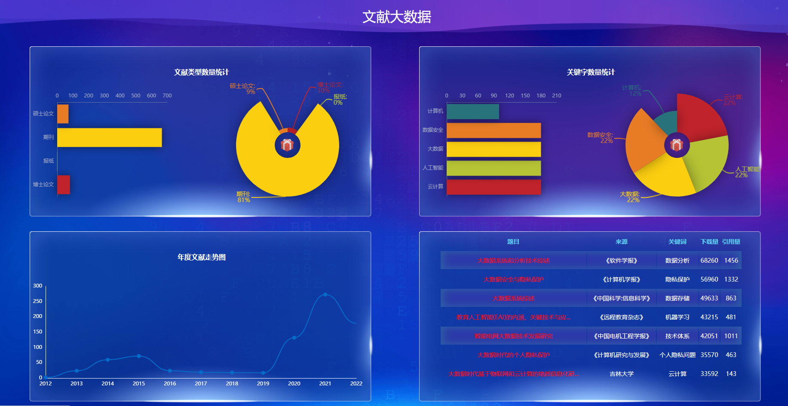
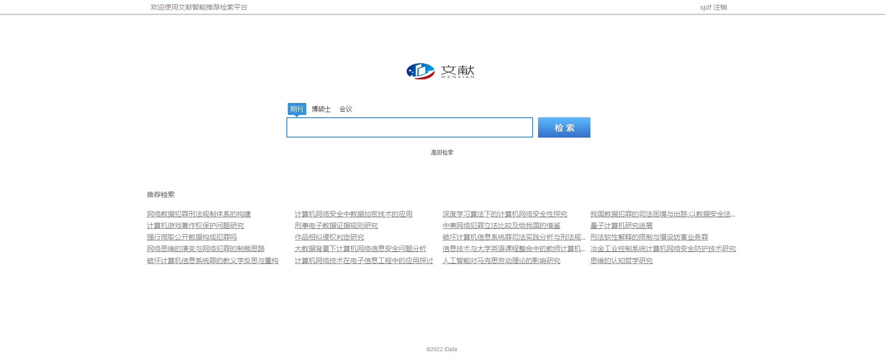
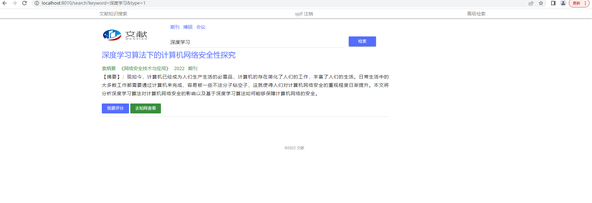
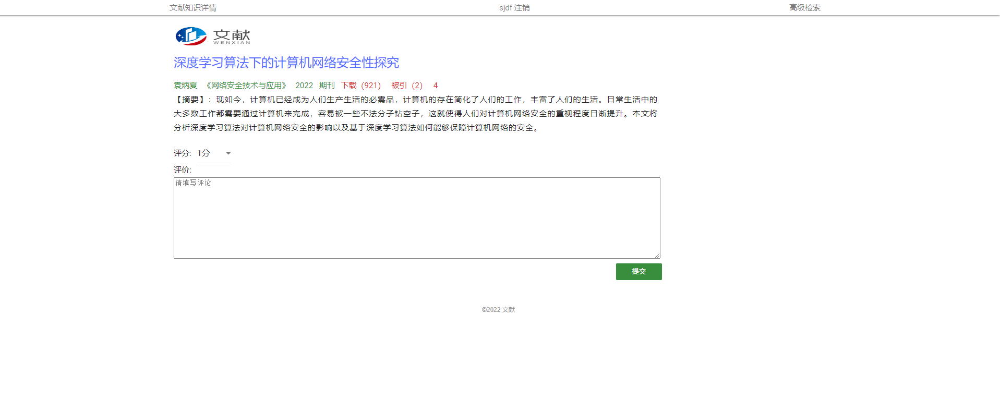
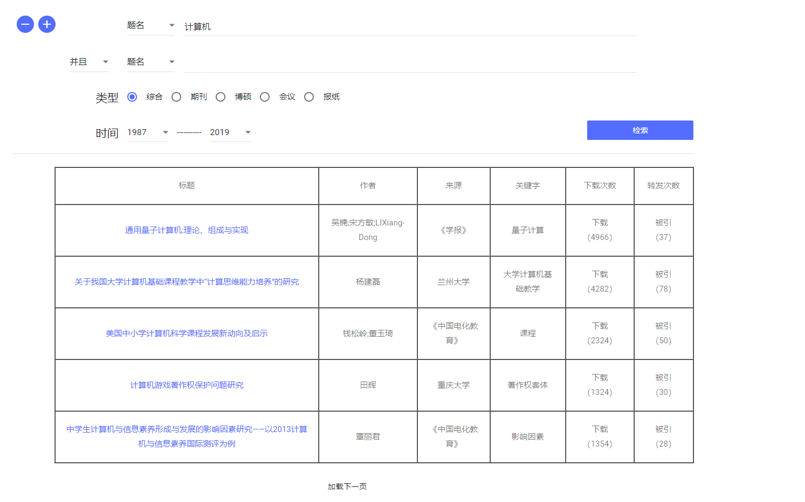
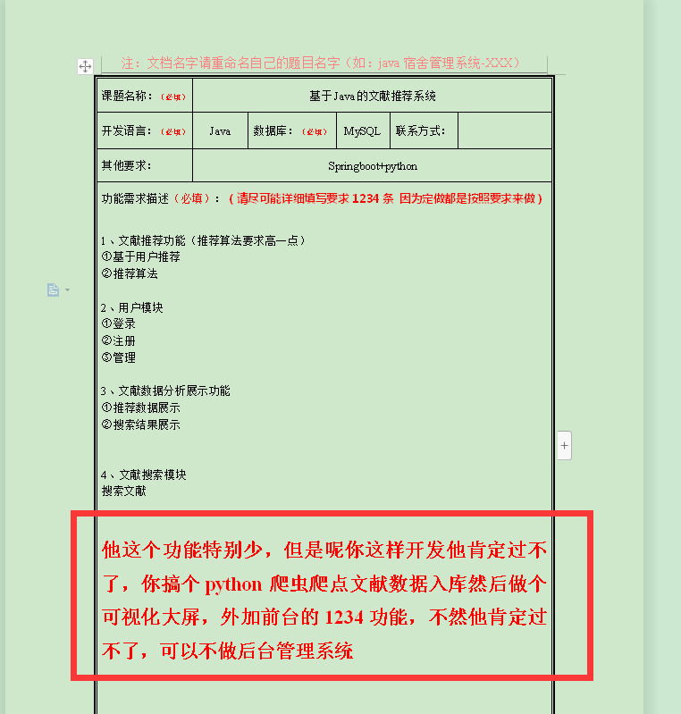

# 计算机毕业设计吊炸天遥遥领先Python+SpringBoot知网文献推荐系统 文献可视化 文献数据分析 文献大数据 大数据毕业设计 大数据毕设 知网文献大屏echarts 大数据毕设 大数据毕业设计

## 要求
### 源码有偿一套(论文 PPT 源码+sql脚本+虚拟机)
### 
### 加好友前帮忙start一下，并备注github有偿获取源码
### 我的QQ号是1158104107 

### 或者 微信 bysj2023nb

### 加qq好友说明（被部分  网友整得心力交瘁）：
    1.加好友务必按照格式备注git虚拟机电影推荐
    2.避免浪费各自的时间

## 开发技术
Python、MySQL、机器学习、echarts、springboot、爬虫

## 创新点

大屏 爬虫 推荐

## 补充说明
适合大数据毕业设计、数据分析、爬虫类计算机毕业设计

# 需求

1、文献推荐功能（推荐算法要求高一点）

①基于用户推荐

②推荐算法

 

2、用户模块

①登录

②注册

③管理

 

3、文献数据分析展示功能

①推荐数据展示

②搜索结果展示

 

 

4、文献搜索模块

搜索文献

 

 

5、搞个python爬虫爬点文献数据入库然后做个可视化大屏

# 运行截图

# 演示视频

https://www.bilibili.com/video/BV15K411Z79Y/?spm_id_from=333.999.0.0